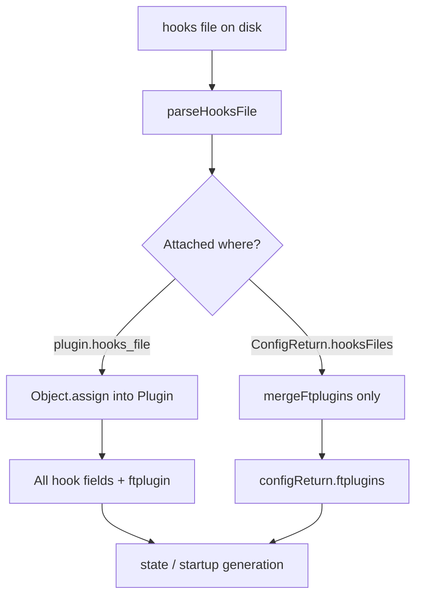

# dpp `hooks_file` reference

Reference for dpp.vim external hook files: the `hooks_file` plugin option, `ConfigReturn.hooksFiles`, `parseHooksFile()`, and `hooksFileMarker`. Verified against `Shougo/dpp.vim` and `Shougo/dpp-ext-toml` source on 2026-07-12.

Status: reference (stable).

Related: [`dpp-config-return.md`](./dpp-config-return.md) (`ConfigReturn`, `hooksFiles`), [`denops-dpp.md`](./denops-dpp.md) (upstream reading list), [`dpp-context-builder.md`](./dpp-context-builder.md) (`ContextBuilder` / `setGlobal`).

## Naming

| Symbol | Layer | Role |
|--------|-------|------|
| `hooks_file` | `Plugin` option / TOML | Path to an external hook file (per plugin or TOML-global) |
| `hooksFiles` | `ConfigReturn` | Array of global hook file paths returned by a config plugin |
| `hooksFileMarker` | `DppOptions` | Start/end marker pair used when parsing hook files |
| `hook_add`, `hook_source`, … | `Plugin` / TOML | Inline hook strings (alternative to `hooks_file`) |
| `hook_files` | — | **Not a dpp API.** Appears only as `hook_files = []` in `deps/merge.toml` in this repo (unused placeholder; dpp ignores unknown TOML keys) |

There is no dpp option named `hook_file` (singular).

## Source location

| Symbol | File | Note |
|--------|------|------|
| `Plugin.hooks_file` | `denops/dpp/types.ts` | `string \| string[]` |
| `ConfigReturn.hooksFiles` | `denops/dpp/base/config.ts` | `string[]` |
| `parseHooksFile()` | `denops/dpp/utils.ts` | Parses marker-delimited sections |
| `mergeFtplugins()` | `denops/dpp/utils.ts` | Merges parsed ftplugin sections |
| Plugin-level consumption | `denops/dpp/dpp.ts` (`makeState`) | `Object.assign(plugin, parseHooksFile(...))` |
| Global consumption | `denops/dpp/dpp.ts` (`makeState`) | `hooksFiles` → **ftplugin only** |
| Vim help | `doc/dpp.txt` | `:h dpp-plugin-option-hooks_file`, `:h dpp-option-hooksFileMarker`, `:h dpp-hooks` |
| TOML help | `dpp-ext-toml/doc/dpp-ext-toml.txt` | `:h dpp-ext-toml-toml-hooks_file` |

## What `hooks_file` is

A **plugin option** (`:h dpp-plugin-option-hooks_file`) that points to one or more files containing hook scripts and optional ftplugin blocks. dpp reads the file during `makeState()` and expands its sections into plugin fields (`hook_add`, `hook_source`, `lua_source`, …) or `ftplugin` entries.

Use it when hooks are too long for inline TOML/`hook_*` strings, or when several hook types should live in one file.

Type: `string | string[]` (multiple paths allowed).

Timing: processed at `dpp#make_state()` time, not at runtime on each `:Dpp` command (except when state is regenerated).

## File format

Controlled by `hooksFileMarker` (default `"{{{,}}}"`; `:h dpp-option-hooksFileMarker`).

Each section:

```
{hook_name} {start_marker}
... script body ...
{end_marker}
```

Example (`start_marker` = `"{{{"`, `end_marker` = `"}}}"`):

```vim
" hook_source {{{
let g:foo = 'bar'
" }}}
" cpp {{{
let g:bar = 'baz'
" }}}
```

### Section name → destination

`parseHooksFile()` routes `{hook_name}` as follows:

| `hook_name` pattern | Assigned to |
|---------------------|-------------|
| `hook_*` | Top-level plugin hook field (e.g. `hook_add`, `hook_source`) |
| `lua_add`, `lua_source`, `lua_depends_update`, `lua_done_*`, `lua_post_*` | Corresponding `lua_*` plugin field |
| Anything else (e.g. `cpp`, `lua_cpp`) | `ftplugin[hook_name]` |

Nested markers inside a section are supported (see unit tests in `utils.ts`).

Invalid section headers (no recognizable hook name before the start marker) are skipped.

## Two consumption paths in `makeState()`

Plugin-level and global paths differ in **what gets merged**.



### 1. Per-plugin `hooks_file`

For each entry in `configReturn.plugins`, after `detectPlugin()` and optional `groups` merge:

1. Expand path via `dpp#util#_expand`
2. Read file lines
3. `Object.assign(plugin, parseHooksFile(marker, lines))`

All parsed hook fields and `ftplugin` become part of that plugin. Parsed `ftplugin` is later merged into `configReturn.ftplugins` when the plugin is finalized.

Also: each `plugin.hooks_file` path is appended to `checkFiles` so missing files are reported after state generation.

### 2. Global `ConfigReturn.hooksFiles`

Paths collected at the config level (including TOML top-level `hooks_file`; see below).

1. Expand each path
2. Read and `parseHooksFile()`
3. **Only** `parsed.ftplugin` is merged into `configReturn.ftplugins` via `mergeFtplugins()`

Hook sections (`hook_add`, `hook_source`, …) in a global `hooksFiles` entry are **not** applied. Use per-plugin `hooks_file`, inline hooks, or `multiple_hooks` for global hook strings.

Global paths are also concatenated into `checkFiles`.

## TOML (`dpp-ext-toml`)

| Location | Maps to | Effect |
|----------|---------|--------|
| Top-level `hooks_file` | `ConfigReturn.hooksFiles` | Global file; **ftplugin sections only** after `makeState()` |
| `[[plugins]]` entry `hooks_file` | `Plugin.hooks_file` | Full parse merged into that plugin |

Top-level TOML `hooks_file` is documented as the global form of `dpp-plugin-option-hooks_file` (`:h dpp-ext-toml-toml-hooks_file`). In this repo, `denops/dpp.ts` pushes each loaded TOML's top-level `hooks_file` into `hooksFiles`:

```ts
if (toml.hooks_file) {
  hooksFiles.push(toml.hooks_file);
}
```

Per-plugin `hooks_file` in TOML is converted to `Plugin` options by `dpp-ext-toml` and follows the per-plugin path above.

## Inline hooks vs `hooks_file` vs `multiple_hooks`

| Mechanism | Scope | Supported hook keys | Notes |
|-----------|-------|---------------------|-------|
| `hook_add`, `hook_source`, `hook_post_source`, … | Single plugin | All standard plugin hook fields | Short scripts; stays in TOML/state |
| `hooks_file` | Single plugin (or global path via `hooksFiles`) | Any field `parseHooksFile` can emit | Long scripts; Vim9 via `:vim9script` inside the file |
| `multiple_hooks` | Listed plugin names | `hook_add`, `hook_source`, `hook_post_source` only | Applied when all named plugins are available / sourced; no `hooks_file` in `MultipleHook` type |

## Caveats (`:h dpp-hooks`)

- Hooks in `makeState()` are **strings** executed as Ex commands; function hooks are not supported in `dpp#make_state()`.
- Loading order among non-lazy plugins is **not guaranteed**.
- Vim9 script works inside `hooks_file` sections (use `:vim9script` / `:def`). Global inline `hook_add` cannot use Vim9 because dpp may merge those strings for optimization.
- Paths are expanded with `dpp#util#_expand` (supports `~`, environment variables, etc.).

## Local repo status

| Path | Usage |
|------|-------|
| `denops/dpp.ts` | Aggregates TOML top-level `hooks_file` into `ConfigReturn.hooksFiles` |
| `denops/helper.ts` | `Toml.hooks_file?: string` type for loaded TOML |
| `deps/dpp.toml` | Uses inline `hook_add` only; no `hooks_file` |
| `deps/merge.toml` | `hook_files = []` — not a dpp key; safe to rename/remove when cleaning TOML |

When adding shared ftplugin snippets via TOML, top-level `hooks_file` + ftplugin sections is valid. When adding plugin initialization hooks from a file, put `hooks_file` on the relevant `[[plugins]]` entry (or use inline / `multiple_hooks`).
